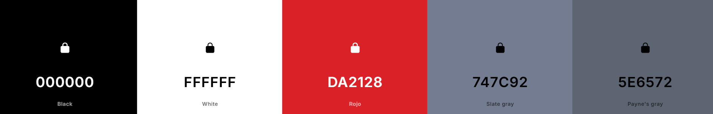
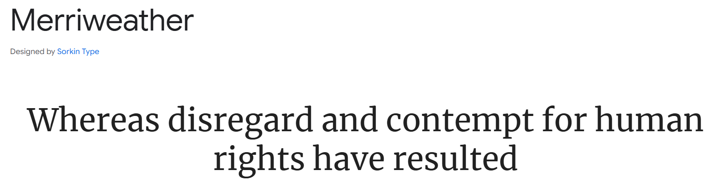
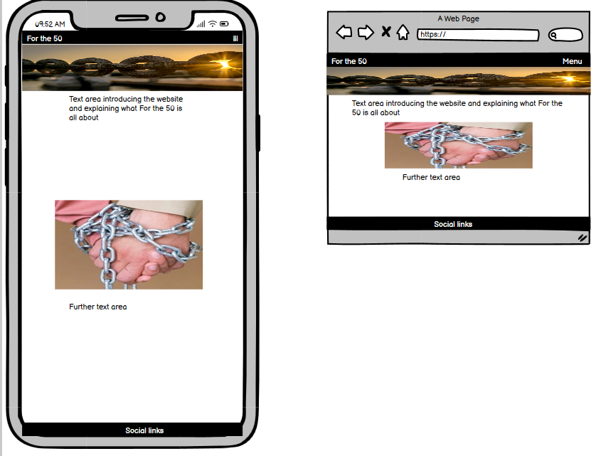
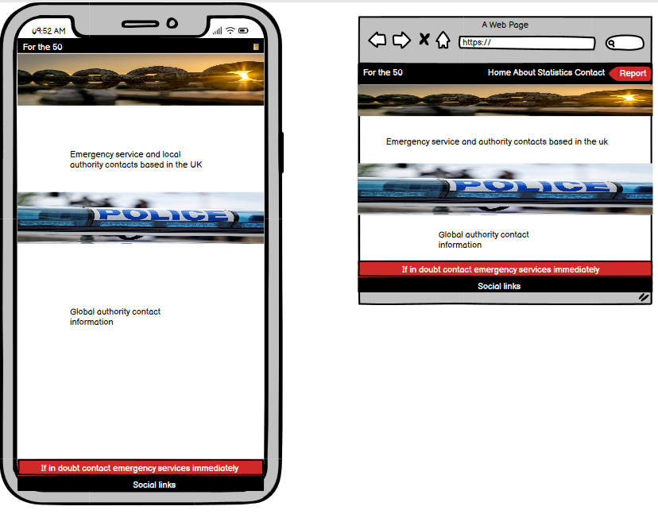

# For the 50 

## Table of Contents

- [For the 50](#for-the-50)
  - [Submission details](#code-to-protect-submission-details)
    - [Deployment](#deployment)
    - [Criteria](#criteria)
  - [About the submission](#about-the-submission) 
    - [Introduction](#introduction)
    - [Goal](#goal)
  - [Pages](#pages) 
    - [Home page](#home-page)
    - [About page](#about-page)
    - [Contact page](#contact-page)
    - [Staistics page](#statistics-page)
  - [UX - User Experience](#ux---user-experience)    
    - [Colour](#colour)
    - [Font](#font)
    - [Wireframes](#wireframes)
  - [Tech Stack](#tech-stack)
  - [Future Developments](#future-development)
  - [Credits](#credits)
  - [Meet the team](#meet-the-team)
  - [Acknowledgements](#acknowledgements)
 
## **Code to Protect: Submission Details**  

### **Deployment**   
View live site here : [For the 50](https://forthe50-67eaa7388853.herokuapp.com/)  

View the project board: [Github projects](https://github.com/users/surfdemon/projects/13)

---

### **Criteria**  
In this section, we will briefly discuss how our team addressed the applicable criteria:  
- **The project fits the theme of raising awareness of Modern Slavery and Human Trafficking.**

The "For the 50" is a perfect fit for the Code to Protect theme. It includes features such as information on the impact of Modern Slvaery and Human Trafficking, charts giving a visual on the statistics, and contact and resource information. The added functioanlity to change the language of the site grants further accisbility to those who may need it the most.

- **The project is well planned and executed (Using GitHub Projects).**

The team demonstrated strong organizational skills by utilizing [Github Projects](https://github.com/users/surfdemon/projects/13) for task management, as well as Slack for instant replies, decision making and help when needed. A Kanban-style board was used to track progress, assign responsibilities, and ensure deadlines were met. This structured approach facilitated collaboration, ensured transparency, and allowed the team to deliver the project efficiently.

- **The project has a basic README that follows the provided template.**

The README adheres to the template provided and is clear, concise, and informative. It includes:

- An overview of the project and its features.
- Links to the deployed project and relevant resources.
- A section outlining team members and credits.
 
- **The project has an overall sense of completeness.**

The project feels complete, with every feature contributing to the user experience:

- The home page sets out the impact Modern Slavery and Human Trafficking has on society and those affected.
- The statistics page shows the extent of the problem and how increase awareness is having a positive impact.
- The contact page provides and outlet for the user and links to further resources.
- The website is available in multiple languages making it accessible to those who are potentially most affected.

---

## **About the Submission**  

### **Introduction**   

Welcome to "For the 50". It is estimated that there are 50 million men, women, and children trapped in modern slavery around the world today. That equates to 1 in 150 people. Awareness is increasing on the subject but more still needs to be done to help the afflicted, and our goal is to showcase the issues surrounding modern slavery, and provide a voice for the 50 million people. 

How can we help? Raising awareness is a positive start but there is so much more. Giving people the necessary tools to identify instances of modern slavery, providing resources and relevant contact details are a minimum that is required. Our mission is to provide a platform for people to stand up against this vile and abhorrent act.

---

### **Goal**  
The **Goal** section provides a concise summary of the main objective or purpose of the project described in this README. It addresses the following aspects:  

-**Problem Statement:**

January is Modern Slavery and Human Trafficking awareness month. It is estimated that in the region of 50 million men, women, and children are affected by this globally. Further Awareness needs to be raised not just of the problem itself, but what can be done to help, how to spot instances, and who to report suspected instances too. Sufferers and survivors also need to be aware of points of contact and aid available.

-**Objective(s):**

Our project aims to highlight issues with Modern Slavery and Human Trafficking. Key objectives include:

Offering insights into what Modern Slavery and Human Trafficking is and how it affects 50 million people worldwide.
Providing relevant authority contacts.
Suggesting evidential criteria of those affected.

-**Target Audience:**

The project is designed for:

Users interested in knowing more about Modern Slavery and Human Trafficking.
Individuals looking for help or advice.
Users who want to report suspected cases.

-**Benefits:**

- Showcases Modern slavery and human trafficking: The site highlights the current problem of Modern Slavery and the impact it has on the individual and society as a whole.
- Offers hope: with survivor stories including the user can be assured that there is aid and resources available for those affected and that the work being done so far by chraitable organisations is having an impact.
- Provides insightful data statistics: through the use of visually appealing pie charts based on national statistic reporting from the UK and Ireland.
- Empowerment: gives the user the tools too identify what may or may not be examples of Modern Slavery through the site itself or the use of a chatbot, and how to report such instances if needed.
- Accessibility and inclusivity: the site is fully responsive and the language can be adjusted to cater for user requirements.

---

## Pages

### Home Page

### About Page

### Contact Page

### Statistics Page

---

## UX - User Experience

#### Colour

The color palette was created through comparisons of similar websites of this nature. The focus of the website is to highlight the atrocities of Modern Slavery and Human Trafficking and the colour pallete was used to create a clean and crisp structure that allows the user to easily digest available information without providing distraction.

### Font

We opted to use a merriweather font for the site. This font is considered to be accessible in regards that it is easy to read on all screens and particularly useful when a site is displaying a high level of information. Merriweather’s reliable style is great for a site that wants to emphasize trust. Where a credibile look is desired the merriweather font is essential.

### Wireframes

The wireframes for For the 50 were made using Balsamiq. 

**Mobile and Desktop views for:**
 
- Home 
- Contact
- Statistics

  
Home Wireframe

  

  

  
Contact Wireframe

  

  

  
Statistics Wireframe

  

---
## **Tech Stack**  
- Frontend: HTML, CSS, JavaScript
- Backend: Python
- Frameworks: Django
- Version Control: Git & GitHub  
- Deployment: Heroku
- Bootstrap CDN - linked as per [Bootstrap docs](https://getbootstrap.com/docs/5.3/getting-started/introduction/)
- [Font Awesome CDN](https://cdnjs.com/libraries/font-awesome)
- [Google Fonts](https://fonts.google.com)
- [Chatbot] (https://www.chatsimple.ai/aichatbot)

---

## Future Development

- A sign up facility for users ro register in order to recieve email updates and newsletters regarding the fight against Modern Slavery.
- Real time statistic reporting showing the most relavent changes based on area and type.
- Events page showing when fund raising events may be taking place and how users can get involved.

---

## Credits

- [Coolers](https://coolors.co/) for color generator used for pallette for the site.
- [IHREC](https://www.ihrec.ie/app/uploads/2023/09/Trafficking-in-Human-Beings-in-Ireland-Digest_FA_web-Final.pdf) for slavery and human trafficking in Ireland
- [blueblindfold](https://www.blueblindfold.ie/wp-content/uploads/2023/08/Human-Trafficking-Annual-Report-2022.pdf)
- [viniciworks](https://vinciworks.com/coursedemo/?courseid=639&utm_medium=ppc&utm_source=adwords&utm_term=modern%20slavery%20compliance&utm_campaign=kd-prospecting-compliance-broadmatch_sql_bid-uk-20250114&hsa_src=g&hsa_kw=modern%20slavery%20compliance&hsa_mt=b&hsa_acc=5332379634&hsa_grp=181919108108&hsa_ad=729022104952&hsa_cam=22117054305&hsa_tgt=kwd-543899733257&hsa_net=adwords&hsa_ver=3&gad_source=1&gclid=Cj0KCQiA-aK8BhCDARIsAL_-H9mXfSCon5kcfu3ya90zCDs3BBJopcylN11ZMXzHw6Xvvs9EVj37ZNoaAlC9EALw_wcB) to research information used on this site.
- [Anti-Slavery International](https://www.antislavery.org/) to research information used on this site.
- [Hope for Justice](https://hopeforjustice.org/) for the basis of the 'For the 50' concept.
- [gov.uk](https://www.gov.uk/government/statistics/modern-slavery-national-referral-mechanism-and-duty-to-notify-statistics-uk-end-of-year-summary-2022/modern-slavery-national-referral-mechanism-and-duty-to-notify-statistics-uk-end-of-year-summary-2022) for statistics based on reporting of Modern Slavery and Human Trafficking within the UK.

## Meet the Team

| Member | Github profile | 
| ---- | ---- |
| Viola Bergere | [violaberg](https://github.com/violaberg) |
| Soroush Gholamreza | [SoroushGReza](https://github.com/SoroushGReza) |
| Chrysanthus Chiagwah | [chrysanthusobinna](https://github.com/chrysanthusobinna) |
| Rob Beach | [surfdemon](https://github.com/surfdemon) |
| Finnbarr Ambrose | [FinnbarrAmbrose](https://github.com/FinnbarrAmbrose) |
| Heath Croasdale | [heath1979](https://github.com/heath1979) |

## Acknowledgements

- As a team we would like the take the time to acknowledge the suffering of the estimated 50 million men, women, and children caught in the trap of Modern Slavery and Human Trafficking. This abhorrent act should have no place in the world and together we stand For the 50.

