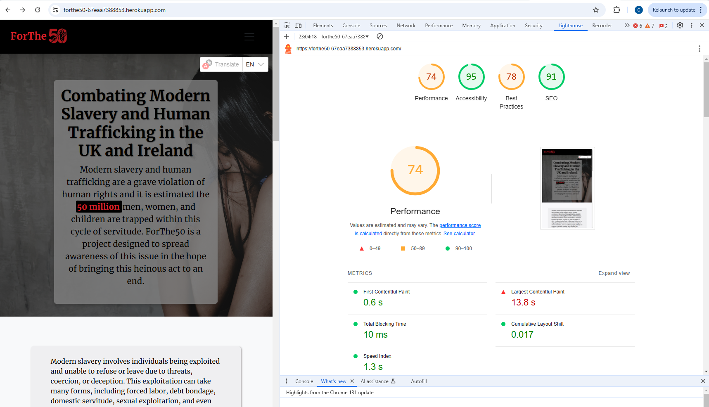
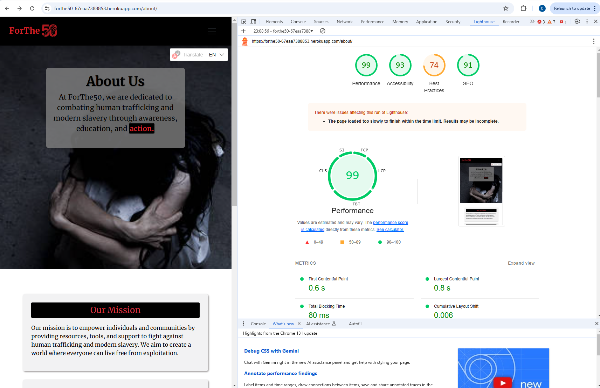
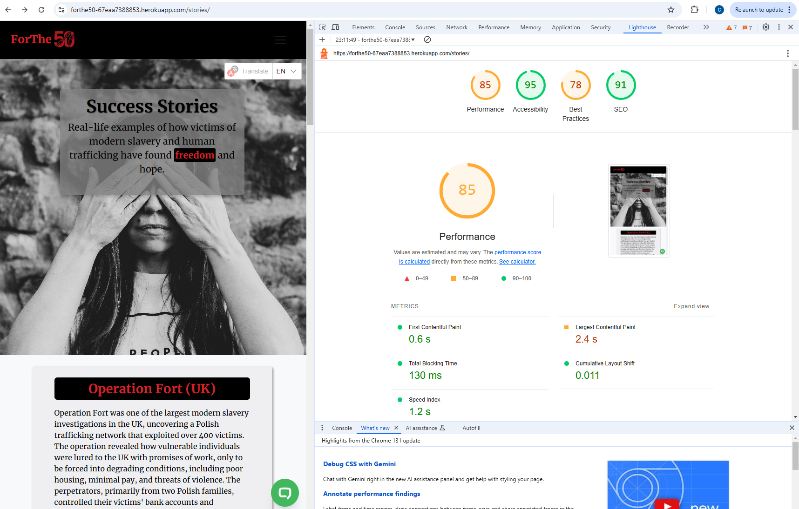
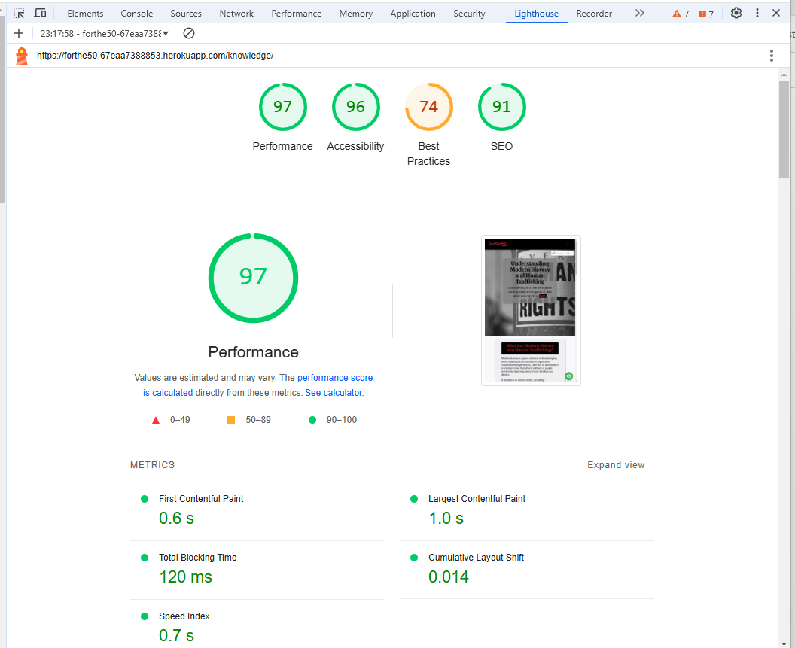
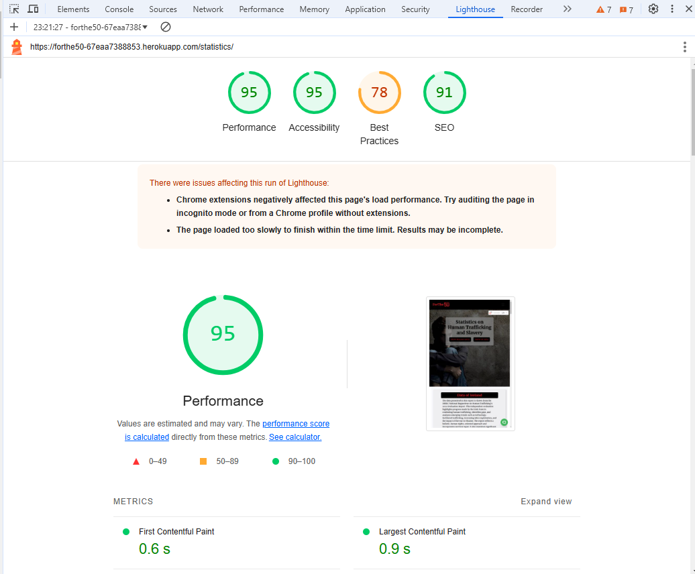
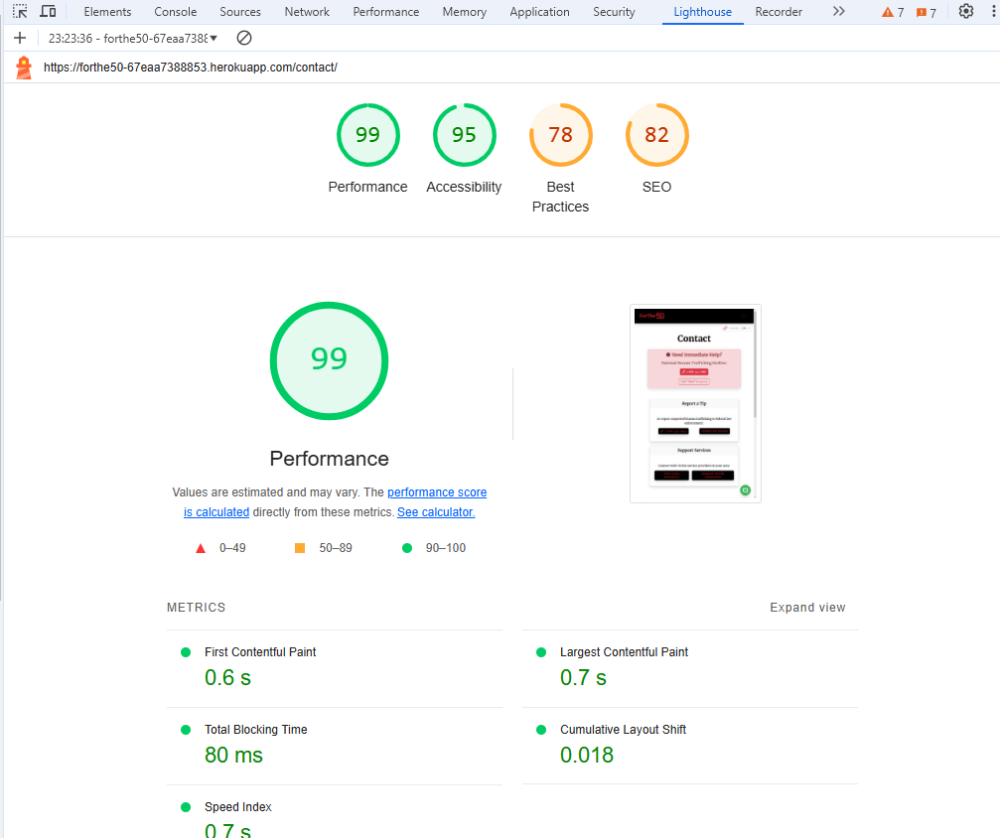
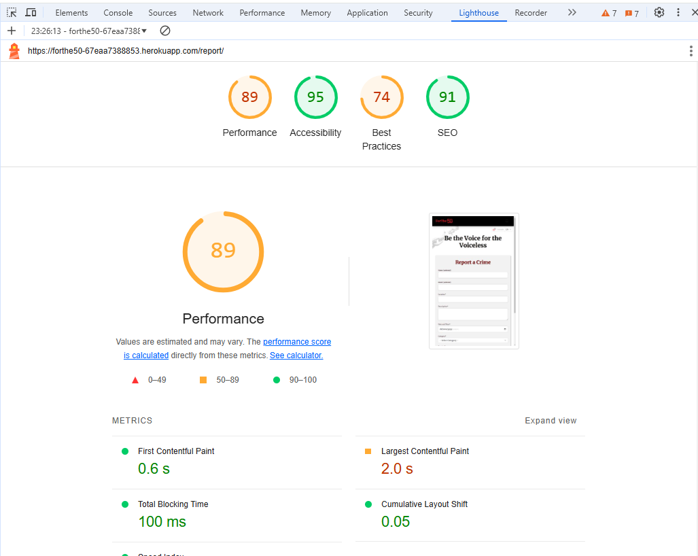
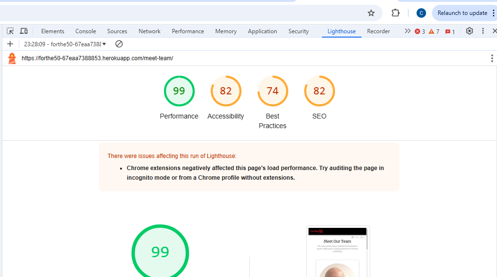

# For the 50

## Table of Contents

- [For the 50](#for-the-50)
  - [Validators and Lighthouse](#validators-and-lighthouse)
  - [Manual Testing](#manual-testing)
    - [Navigation](#navigation-testing)

## Testing

Behavior-driven development (BDD), manual testing, and webpage testing were employed to ensure the website functions correctly and adheres to quality standards. Each page was thoroughly evaluated using various tools to verify its performance, accessibility, and compliance with web standards.

## Validators and Lighthouse

### Home Page

- **HTML Validation**: The HTML structure of the Home Page was validated using the W3C HTML Validator. The result was successful with no errors or warnings, confirming compliance with web standards and ensuring robust cross-browser compatibility.

  

- **Google Chrome Lighthouse Assessment**: The Home Page was assessed using Google Chrome Lighthouse to evaluate its performance, accessibility, best practices, and SEO.  
  - **Performance**: 74 - "The page demonstrates good performance with room for further optimization."  
  - **Accessibility**: 95 - "Excellent accessibility ensures the page is user-friendly for a diverse audience."  
  - **Best Practices**: 78 - "Adherence to best practices is commendable, with minor areas for improvement."  
  - **SEO**: 91 - "Strong SEO implementation enhances search engine visibility."

  

---

### About Page

- **HTML Validation**: The About Page's HTML was rigorously validated using the W3C HTML Validator. The validation was successful, indicating the page is well-structured and adheres to web standards.

  

- **Google Chrome Lighthouse Assessment**: The About Page achieved the following scores during the Lighthouse evaluation:  
  - **Performance**: 99 - "Exceptional performance indicates a highly optimized page."  
  - **Accessibility**: 93 - "The page is highly accessible, ensuring inclusivity for all users."  
  - **Best Practices**: 74 - "Good adherence to best practices with scope for refinement."  
  - **SEO**: 91 - "Strong SEO strategies contribute to excellent search visibility."

  

---

### Stories Page

- **HTML Validation**: The Stories Page was successfully validated using the W3C HTML Validator, confirming error-free HTML and compliance with web standards.

  

- **Google Chrome Lighthouse Assessment**: The Stories Page results are as follows:  
  - **Performance**: 85 - "The page shows solid performance, providing a smooth user experience."  
  - **Accessibility**: 95 - "Outstanding accessibility ensures the content is easily navigable for all users."  
  - **Best Practices**: 78 - "The page adheres to recommended practices, enhancing its reliability."  
  - **SEO**: 91 - "Effective SEO implementation boosts discoverability."

  

---

### Knowledge Page

- **HTML Validation**: The Knowledge Page's HTML passed the W3C validation successfully, ensuring a clean and error-free structure.

  

- **Google Chrome Lighthouse Assessment**: Key scores for the Knowledge Page:  
  - **Performance**: 97 - "Excellent performance ensures quick loading and smooth interactions."  
  - **Accessibility**: 96 - "Superior accessibility provides an inclusive experience for all users."  
  - **Best Practices**: 74 - "A solid foundation of best practices with opportunities for further refinement."  
  - **SEO**: 91 - "Strong SEO techniques improve the page's visibility."

  

---

### Statistics Page

- **HTML Validation**: The Statistics Page was validated without errors using the W3C HTML Validator, confirming compliance with web standards.

  

- **Google Chrome Lighthouse Assessment**: The Statistics Page scored:  
  - **Performance**: 95 - "Impressive performance ensures a fast and efficient experience."  
  - **Accessibility**: 95 - "High accessibility standards make the page user-friendly for everyone."  
  - **Best Practices**: 78 - "The page adheres to best practices, ensuring reliability and security."  
  - **SEO**: 91 - "Effective SEO enhances search engine ranking."

  

---

### Contact Page

- **HTML Validation**: The Contact Page's HTML passed the W3C validation test successfully, ensuring no structural issues.

  

- **Google Chrome Lighthouse Assessment**: The Contact Page received the following scores:  
  - **Performance**: 99 - "Exceptional performance reflects a well-optimized page."  
  - **Accessibility**: 95 - "Outstanding accessibility ensures ease of use for all visitors."  
  - **Best Practices**: 78 - "The page adheres to best practices with minor areas for improvement."  
  - **SEO**: 82 - "Good SEO strategies enhance discoverability."

  

---

### Report Page

- **HTML Validation**: The Report Page passed the W3C validation successfully, ensuring an error-free HTML structure.

  

- **Google Chrome Lighthouse Assessment**: Report Page scores include:  
  - **Performance**: 89 - "The page offers reliable performance with room for optimization."  
  - **Accessibility**: 95 - "The page meets high accessibility standards for inclusivity."  
  - **Best Practices**: 74 - "Adherence to best practices contributes to reliability."  
  - **SEO**: 91 - "Strong SEO implementation supports better visibility."

  

---

### Meet the Team Page

- **HTML Validation**: The Meet the Team Page's HTML was validated successfully, confirming it adheres to web standards.

  

- **Google Chrome Lighthouse Assessment**: The scores for this page are:  
  - **Performance**: 99 - "Outstanding performance ensures a seamless user experience."  
  - **Accessibility**: 82 - "Good accessibility ensures usability for a wide audience."  
  - **Best Practices**: 74 - "The page follows best practices with minor areas for enhancement."  
  - **SEO**: 82 - "Effective SEO practices enhance search visibility."

  

## Manual Testing

| FILE     | VALIDATOR SCREENSHOT                                                                                    | RESULT            |
| -------- | ------------------------------------------------------------------------------------------------------- | ----------------- |
| ***ForThe50*** |
| views.py    | 

Views

 | <mark>PASS</mark> |
| urls.py     | 

Urls

 | <mark>PASS</mark> |
| settings.py | 

Settings

 | <mark>few errors but these were't be split for better functionality</mark> |
| ***ForThe50*** |
| views.py   | 

Models

 | <mark>PASS</mark> |
|  |  |  |

### **Navigation Testing**

| Element                | Action      | Expected Result                                         | Pass/Fail         |
| ---------------------- | ----------- | ------------------------------------------------------- | ----------------- |
| Logo                   | Click       | Redirect to Home page                                   | <mark>PASS</mark> |
| Footer Socials         | Click       | Redirect in a new tab to all respective media platforms | <mark>PASS</mark> |
